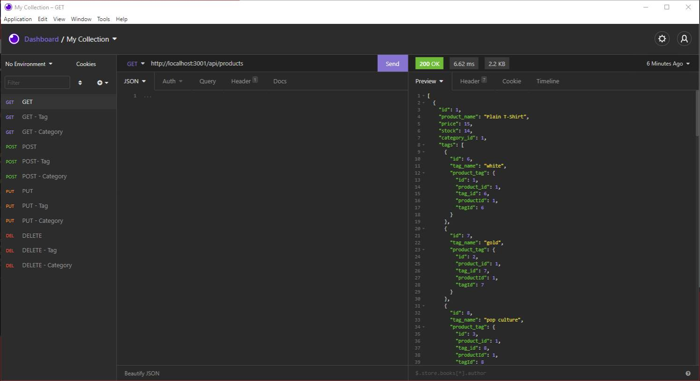

# 13-ORM-02-Homework

## Description

E-Commerce Back End

- To Interact with a MySQL database using Insomnia
- Store Products, Categories and Tags in db tables.

##  Useage

- Run npm start in terminal.
- Process schema.sql in MySQL shell.
- Run npm run seed.
- Open Insomnia and Interact with the following
    - GET
        - http://localhost:3001/api/products/
        - http://localhost:3001/api/products/2
        - http://localhost:3001/api/tags/
        - http://localhost:3001/api/tags/2
        - http://localhost:3001/api/categories
        - http://localhost:3001/api/categories/2
    - POST
        - http://localhost:3001/api/products
        - http://localhost:3001/api/tags
        - http://localhost:3001/api/categories
    - PUT
        - http://localhost:3001/api/products/6
        - http://localhost:3001/api/tags/9
        - http://localhost:3001/api/categories/6
    - DELETE
        - http://localhost:3001/api/products/6
        - http://localhost:3001/api/tags/9
        - http://localhost:3001/api/categories/6

##  Credits

University of Minnesota Boot Camp:
https://umn.bootcampcontent.com/University-of-Minnesota-Boot-Camp